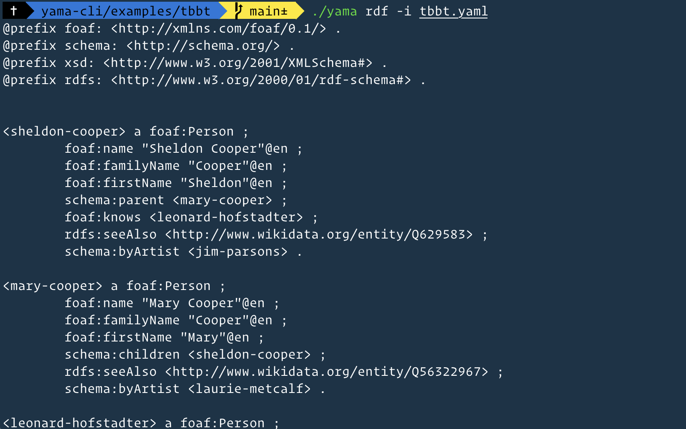

# yama-cli
A CLI utility to work with YAMA and YAMAML files

```bash
usage :

	shex
		Generate ShEx from YAMA
		yama shex -i [path/to/yama/file] -o [path/to/output/shex/file]
	rdf
		Generate RDF from YAMAML
		yama rdf -i [path/to/yama/file] > [path/to/output/rdf/file]
```

To run use Deno runtime:

```bash
deno run --unstable --allow-all --no-check yama.js
```

Compile yama binary using Deno:

```bash
deno compile --unstable --allow-all --no-check --output yama yama.js
```

### YAMA to RDF



### YAMA to ShEx
